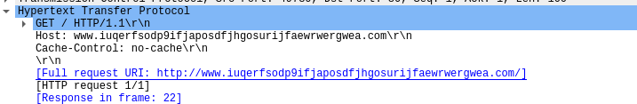

### Wannacry Analysis
Wannacry is a self propogating malware which is classified as crypto-ransomware afftecting more than 200K computers in 2017. A Crypto ransomware is a harmful computer program that encrypts user's files for money extortion purpoeses(Ransom). This malware has worm capaibility which can propogate to other computers through computer networks.

Wannacry malware exploits the vulnerability that is in Server message Block(SMB) Protocol of the windows implementation. SMB is a Transport protocol used for file sharing , printer sharing and remote services in windows. This protocol operates over TCP port 445 and 139. The malware makes use of SMBv1 and TCP port 445 to propogate. This vulnerability allows malformed packets from the remote attackers to execute arbitary code on the victims computer.

Let's discuss about few **Terminologies** to understand before execution:-

**Crypto Ransomware:-** Crypto ransomware is malware that executed on victim's device and demands a ransom(money) to restore it.

**Mutex:-** Mutex is a program object that is created so that multiple program threads can take turns sharing same resource such as aceess to a file.

### Analysis:-

- When the dropper is executed, it first makes a contact to a domain "http://www[.]iuqerfsodp9ifjaposdfjhgosurijfaewrwergwea[.]com" and exits if there is a response. If there is no response, then the dropper creates a service called 'mssecv2.0'.
  
  

- This service extracts to the encrypted binary and writes to "C:/windows/taskche.exe" 
  ![[Pasted image 20230407193805.png]]

- This binary checks to see if a mutex "MsWinZonesCacheCounterMutexA0" exists, and wil not proceed if present. Norably, the malware is checking for the presence of previous wannacry malware program and exits itself if present.
- If this mutex does not present, then it releases a password protected zip file(password: WNcry@2017) and this Zip file has following files:

  ![[zip file contents.png]]
- Msg folder contains Rich Text Format files with the extension .wncry. These files are the "Readme" file used by the @wanaDecryptor@.exe decryptor program in languages such as english, italian, romanian, chineese, dutch etc.
- b.wnry is the following bitmap file(image) displaying instruntions for decryption
  ![[Pasted image 20230407195054.png]]

- c.wnry contains tor addresses to contact back to its author or for payment related queries
- s.wmry, a zip file containinf the tor software executable.
- u.wnry, is the `@wanadecryptor@.exe` decypter file
- taskdl.exe, which is used for file deletion
- taskse.exe, responsible for spreading the malware on each session

After dropping these files, the malware attemps to change the attribue of the files to `hidden` and grants full access to all files in the current directory and directories below using the command `attrib +h` and follwed by `icacls . /grant Everyone:F /T /C /Q`

_Mylab_

Then wannacry proceeds to encrypt files on the system, searhing for follwing extensions which afer hardcoded in the binary.

![[337974545_1222113941765001_6485294638797538329_n.png]]

Moreover, a registry key is written to "HKLM/SOFTWARE/Wow6432Node\WanaCrypt0r\wd" that adds a key to reference the location from which Wannacry was originally executed.

The WannaCry encrypter launches the embedded decrypter binary “@WanaDecryptor@.exe,” which displays two timers and instructions for sending the ransom in the configured language of the infected system. The instructions demand a payment of $300 worth of bitcoins to a specified address.